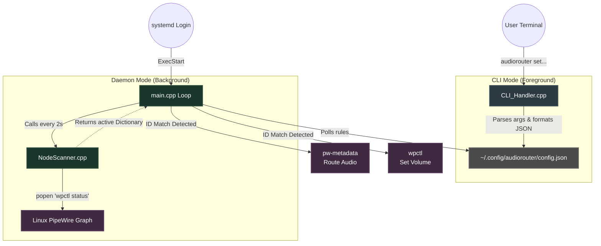

# Dynamic Audio Router (audiorouter)

[](https://isocpp.org/)
[]()
[]()

A lightweight, autonomous C++ background daemon and CLI utility for Linux. **audiorouter** solves the problem of volatile PipeWire/WirePlumber Node IDs by dynamically intercepting audio streams and automatically routing them to user-defined sinks with specific volume levels.

---

## Features

* **Dual-Mode Architecture:** Functions as both a background daemon and a quick CLI management tool.
* **Zero-Latency Autonomous Routing:** Intercepts PipeWire nodes in real-time; never lose your audio routing when an app restarts.
* **Persistent Configuration:** Saves rules in standard XDG paths (`~/.config/audiorouter/config.json`).
* **systemd Integration:** Installs as a user service for seamless boot initialization.
* **Resource Efficient:** Written in pure C++ using kernel pipes (`popen`) with minimal CPU footprint.

---

## Architecture & Flowchart

The application relies on a dual-path execution model. Terminal commands bypass the daemon to safely update the shared JSON configuration, which the daemon actively polls and applies to live system audio graphs.



## Installation
### Requirements

* A Linux Distribution running PipeWire and WirePlumber.
* g++ compiler and make.

## Build and Install
Clone the repository and use the provided Makefile to compile and install the binary and system service globally

* `git clone [https://github.com/yourusername/audiorouter.git](https://github.com/yourusername/audiorouter.git)`
* `cd audiorouter`
* `make`
* `sudo make install`

## How to use
* **Run the daemon** : `audiorouter` 
* **Add or Update a rule** : `audiorouter set <app_name> <target_sink> <volume>`(eg audiorouter set spotify speaker 0.5)
* **List all configured application** : `audiorouter list`
* **Delete a configuration** : `audiorouter remove <app_name>` 
* **Update the volume of a configuration** : `audiorouter set-volume <app_name> <volume>`

> [!IMPORTANT]
> **How to Find Your Target Sink Name:**
> When setting a routing rule, PipeWire requires the internal system **`node.name`**, not the friendly display name.
> 
> To list the exact names of all your active audio sinks, run this command in your terminal:
> ```bash
> pactl list sinks short
> ```
> Copy the exact name from the second column (e.g., `alsa_output.pci-0000_00_1f.3.analog-stereo` or `Virtual_Speaker`) and pass it to `audiorouter`:
> ```bash
> audiorouter set spotify alsa_output.pci-0000_00_1f.3.analog-stereo 0.5
> ```
> Example
> 

> [!NOTE]
> **How Volume Rules Work:**
> Volumes set by `audiorouter` apply directly to the application's individual audio stream, not your system's master volume slider. 
> 
> The final audible volume is a multiplication of both: if your Master Speaker is set to `50%` (`0.5`) and you route Spotify to `0.4` (`40%`), Spotify will play at `20%` of your hardware's total capacity (`0.5 × 0.4`). This ensures your keyboard's master volume controls always remain the global ceiling for all audio!


### Run it as a Background User Service(Recommended)
If you want that the tool turns on when you login the system just make it a user service via these commands :-

**->1. Ensure your personal systemd folder exists**
`mkdir -p ~/.config/systemd/user`

**->2. Copy the service file to your personal folder**
`cp audiorouter.service ~/.config/systemd/user/`

**->3. Tell your systemd to refresh and look for new files**
`systemctl --user daemon-reload`

**->4. Enable and start the daemon immediately**
`systemctl --user enable --now audiorouter.service`

## Uninstallation

To completely remove the binary, clear the systemd service, and stop the daemon safely.
* `sudo make uninstall`